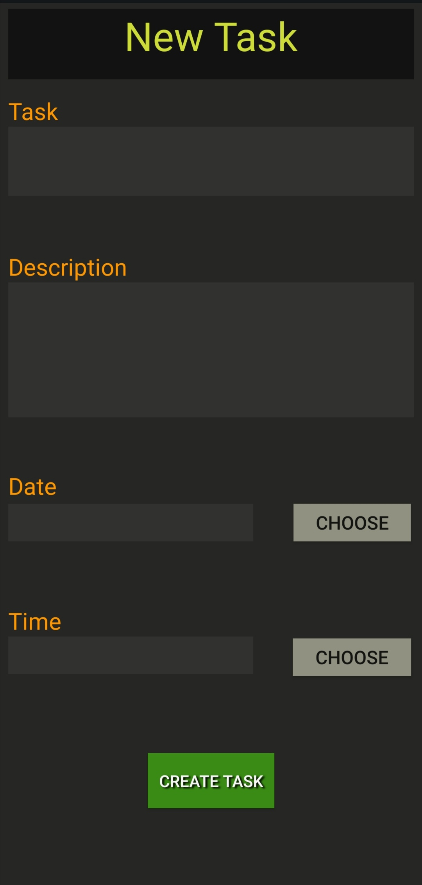
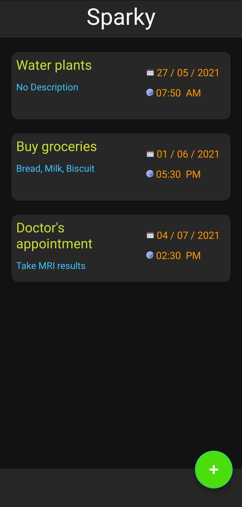
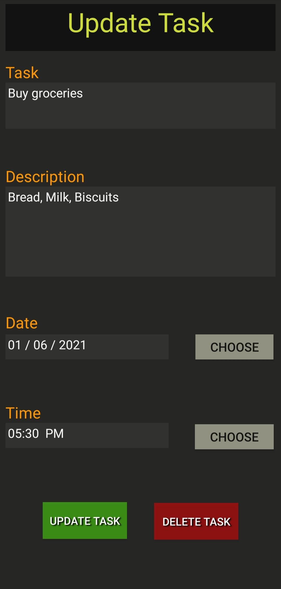

# Sparky
Sparky is an Android task reminder app built using kotlin. It uses Room Database to establish a local database to store the data

## Screenshots

&nbsp &nbsp

&nbsp &nbsp

&nbsp &nbsp

## Installation
Download the source code or clone it using  
`https://github.com/Abhijith-K-S/Sparky.git`

Open the project in Android Studio and create a new project from the source code
